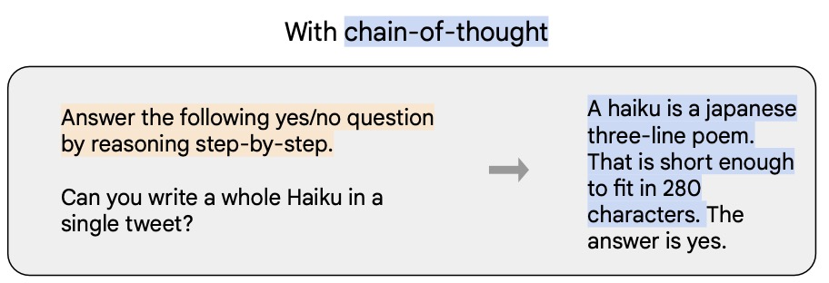

# 特制自己的ChatGPT: 多接口统一的轻量级LLM-IFT平台


项目简称：
Alpaca-CoT（当羊驼遇上思维链）

项目标题：
Alpaca-CoT: An Instruction Fine-Tuning Platform with Instruction Data Collection and Unified Large Lnguage Models Interface

项目链接：
[https://github.com/PhoebusSi/Alpaca-CoT](https://github.com/PhoebusSi/Alpaca-CoT)


## 0. ChatGPT背后的技术

**LLM**: （ **Large Language Models**）指经过大规模预训练且体量较大的语言模型，一般是transformer-based模型。

**IFT**: （ **Instruction Fine-Tuning**）指令微调，指令是指用户传入的目的明确的输入文本，指令微调用以让模型学会遵循用户的指令。

**CoT**: （ **Chain-of-Thought**）指令形式的一种特殊情况，包含step-by-step的推理过程。如下图蓝色部分所示。



## 1. 定位


ChatGPT的出现验证了大型语言模型(LLM)在通用人工智能(AGI)上的潜力。基于LLaMA[1]等Large Language Models(LLMs)的instruction-tuning研究(如，Alpaca[2])大幅度加速了复现ChatGPT的进程。**Alpaca-CoT**希望在这个研究方向上做出适度的贡献，以推进LLMs的开源进程、降低LLMs研究和使用成本。

具体来说，**Alpaca-CoT**项目旨在探究如何更好地通过instruction-tuning的方式来诱导LLM具备类似ChatGPT的交互和instruction-following能力。为此，我们广泛收集了不同类型的instruction（尤其是Chain-of-Thought数据集），并将包含LLaMA、ChatGLM、Bloom等多种LLMs集成进来统一接口。在这基础上，我们基于LLaMA给出了深入细致的实证研究，以供未来工作参考。据我们所知，我们是首个将CoT拓展进Alpaca的工作，因此项目简称为"**Alpaca-CoT**"。


热烈欢迎您向我们提供任何未被本项目收集的instruction-tuning及各类tasks数据集（或其来源）。我们将：
- 将这些数据收录并进行统一格式化处理；
- 用这些数据集instruct fine-tune 一系列的LLM（如llama, ,未来将集成更多LLMs），并开源其checkpoint；
- 进行广泛的实证研究以探究新收录的数据集的作用。

我们希望我们的项目能够为大型语言模型的开源过程做出适度的贡献，并降低NLP研究人员上手LLM相关研究的门槛。


## 2. 概述

近期，LLaMA[1]显示出惊人的zero-shot和few-shot能力，仅需较少的参数即可和GPT-3.5性能相当（LLaMA-13B显著优于GPT-3（175B），LLaMA-65B与PaLM-540MB相当），明显降低了训练、微调和使用competitive大型语言模型的成本。最近，为了提高LLaMA的instruction-following能力，Stanford Alpaca[2]借助self-instruct[3]的方式生成的52K Englishi instruction-finetuning数据对LLaMA进行了微调，达到了客观的效果。然而，目前该方向的研究仍然面临着以下三个挑战：
- LLaMA-7b依然对计算资源有着较高的要求；
- 用于instruction finetuning的开源数据集较少，缺少整合资源；
- 缺乏各instruction类型带来的影响的实证研究，如响应中文的能力和CoT能力。

为此，我们提出了**Alpaca-CoT**项目，该项目结合了相关的近期前沿技术，具有以下优势：
- 1. **_仅需要较低计算资源即可高效完成对LLaMA的微调_**。`7b`,`13b`和`30b`版本的LLaMA模型均可在单卡80G A100上完成训练。我们的代码主要修改自Alpaca-LoRA，其使用了low-rank adaptation (LoRA)[4], PEFT和bitsandbytes等技术来达到降低计算资源需求的效果。
- 2. 我们发布的模型 **_显著提升了CoT(reasoning)推理能力_**。
- 3. 我们发布的模型 **_显著提升了对中文指令的响应能力_**。
- 4. 维护了一个仍在不断扩大规模的 **_intruction-finetuning的数据集集合_**。该集合包含了中文、英文和CoT的instruction数据。同时，我们也维护了一个训练自各种instruction数据集的模型checkpoint集合。
- 5. 集成了 **_多种LLMs并统一了调用接口_**，可通过超参轻松切换。目前包含 **LLaMA, ChatGLM**[5]和 **Bloom**[6]，后续将持续加入更多,以供研究者们轻松调用和对比不同LLMs。
- 6. 提供了详尽透彻的 **_Empirical Study_**，这里的findings可能会对促进未来LLM探索有一定的参考价值。

## 3. 多接口统一的开源平台
为了便于研究者们在LLM上做系统的IFT研究，我们收集了不同类型的instruction数据，集成了多种LLM，并统一了接口，可以轻松定制化想要的搭配：
- `--model_type`: 设置想要研究的LLM，目前已支持[llama, chatglm和bloom]，其中后两者的中文能力较强，后续将会集成更多的LLMs。
- `--data`: 设置用以IFT的数据类型，以灵活特制想要的指令遵循能力，如追求较强的推理能力可设置alpaca-cot，较强的中文能力可设置belle1.5m，金融相关的响应能力可设置finance。
- `--model_name_or_path`: 与`--model_type`相对应，用来加载目标LLM的不同型号权重。如，要加载llama的13b的模型权重时可设置decapoda-research/llama-13b-hf。 

```
# 单卡
CUDA_VISIBLE_DEVICES=0 python3 uniform_finetune.py --model_type llama --model_name_or_path decapoda-research/llama-7b-hf \
    --data alpaca-belle-cot --lora_target_modules q_proj v_proj 
    
# 多卡
python3 -m torch.distributed.launch --nproc_per_node 4  \
    --nnodes=1 --node_rank=0 --master_addr=xxx --master_port=yyy uniform_finetune.py \
    --model_type llama --model_name_or_path decapoda-research/llama-7b-hf \
    --data alpaca-belle-cot --lora_target_modules q_proj v_proj 
```
你可以在[这里](https://huggingface.co/QingyiSi/Alpaca-CoT/tree/main)下载训练自各种类型instruction数据的所有checkponts。然后，在`gernerate.py`中的`LoRA_WEIGHTS`设置成下载路径，即可直接运行模型的inference以查看模型效果。

## 4. 指令数据集合
该集合仍在不断更新和扩增中。可在以下链接下载和查看更多数据细节：https://github.com/PhoebusSi/alpaca-CoT/tree/main/data
### 数据统计
注意：下图是截止到2.26日收集到的数据集的统计情况，仅作为motivation展示。目前已收集了更多数据集，如金融相关的指令数据集。

当前的instruction-finetuning数据集合主要包含以下三个部分：
- `alpaca_data_cleaned.json`: 包含5万左右英文指令数据。
- `CoT_data.json`: 包含9个CoT数据集，共7万条左右数据。（相关的数据集由FLAN[7]发布，我们统一了数据format）
- `belle_data_cn.json`:  包含50万左右中文指令数据。（相关的中文instruction数据由BELLE[8]发布）


### 数据下载
你可以在[这里](https://huggingface.co/datasets/QingyiSi/Alpaca-CoT/tree/main)下载所有我们已经统一格式后的formatted数据。然后，将下载到的文件全部放到[data](https://github.com/PhoebusSi/alpaca-CoT/tree/main/data) folder。

### 数据格式
我们集合中的所有数据均已被转化成相同的格式，每个样本的格式如下：
```
[
{"instruction": instruction string,
"input": input string, # (may be empty)
"output": output string}
]
```
注意，对于CoT数据集,我们首先使用FLAN提供的[template](https://github.com/google-research/FLAN/blob/main/flan/v2/templates.py)将其从原数据转化成Chain-of-Thought的形式，之后再统一成以上格式。格式统一化的脚本可以在[这里](https://github.com/PhoebusSi/alpaca-CoT/blob/main/data/origin_cot_data/formating.py)找到。 

## 5. 模型效果
### 关于CoT和Chinese Instructions的消融对比
"w/o CoT" and "w/o CN" 分别表示用在instruction-finetuning期间不采用CoT数据和Chinese instructions。

下图是需要推理能力的问题上的表现：

 
下图是需要遵循中文指令的问题上的表现：

 
下图是在较复杂问题上的表现：


从以上样例可以看出，从我们完整数据集collection(英文、中文和CoT指令数据)中微调得到的模型可以显著提高reasoning能力和响应中文指令的能力。

### 更多能力展示


## 6. 对比实验

### CoT能力
下图是引入**CoT**能力前(原Alpaca)后(Ours w/CoT)的表现对比:

可以看出，我们的模型不仅可以给出准确的答案，而且还可以给出对应的思考过程。

### 遵循中文指令的能力
下图是引入**遵循中文指令**能力前后在中文指令上的表现对比:

其中Alpaca未使用任何中文指令数据集，Belle在更多的中文指令数据集中微调关注multiple-lingual的大语言模型BLOOM。
可以看出，原模型Alpaca在第一个例子中无法准确识别中文指令，在第三个例子中无法用中文响应中文指令。而我们的模型表现基本与Belle持平。后续，我们将会引入更多中文指令数据，同时我们的repository将分出一个branch专门探究中文交互能力。


下图是引入**遵循中文指令**能力前后在英文指令上的表现对比:

可以看出，在中文指令数据集上微调后，并不会对模型follow英文指令造成负面影响。


## 7. 总结
在LLM上的instruction-finetuning研究是一个impressive的方向，其加速了复现ChatGPT的进程。然而，由于instruction数据集的开源工作较少，大模型训练需要极高计算资源等原因，目前相关的研究仍处于起始阶段，几乎被OpenAI、微软、Google、Meta等大公司垄断。我们的工作**Alpaca-CoT**在解决这两个问题上各迈出了一小步：基于Alpaca-LoRA的技术路线（单机可训）来降低计算资源消耗，同时不断集成进更多的LLM，持续收集、统一格式化指令数据以搭建更方便的研究平台。并且，我们提供了些细致的findings以供有相同兴趣的研究者参考。欢迎大家在我们工作的基础上作出进一步的探究和改进！
          
## 参考文献
[1]: [LLaMA: Open and Efficient Foundation Language Models](https://arxiv.org/abs/2302.13971v1)

[2]: [Stanford Alpaca: An Instruction-following LLaMA model](https://github.com/tatsu-lab/stanford_alpaca)

[3]: [Self-Instruct: Aligning Language Model with Self Generated Instructions](https://arxiv.org/abs/2212.10560)

[4]: [LoRA: Low-Rank Adaptation of Large Language Models](https://arxiv.org/pdf/2106.09685.pdf)

[5]: [ChatGLM: An Open Bilingual Dialogue Language Model](https://github.com/THUDM/ChatGLM-6B)

[6]: [BLOOM: A 176B-Parameter Open-Access Multilingual Language Model](https://arxiv.org/abs/2211.05100)

[7]: [FLAN: Scaling Instruction-Finetuned Language Models](https://arxiv.org/abs/2210.11416)

[8]: [BELLE: Bloom-Enhanced Large Language model Engine](https://github.com/LianjiaTech/BELLE)


          

